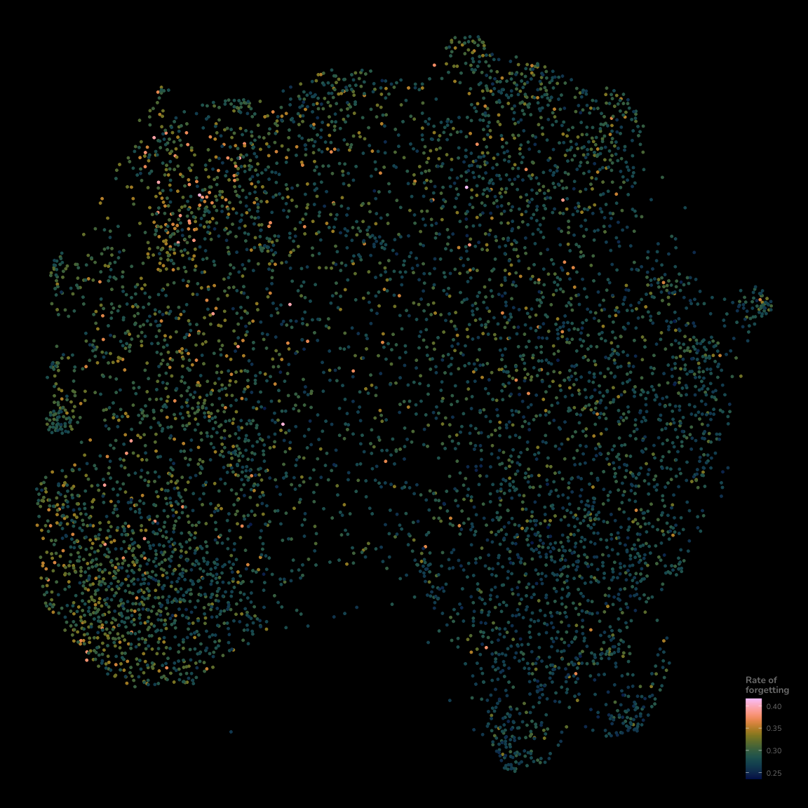
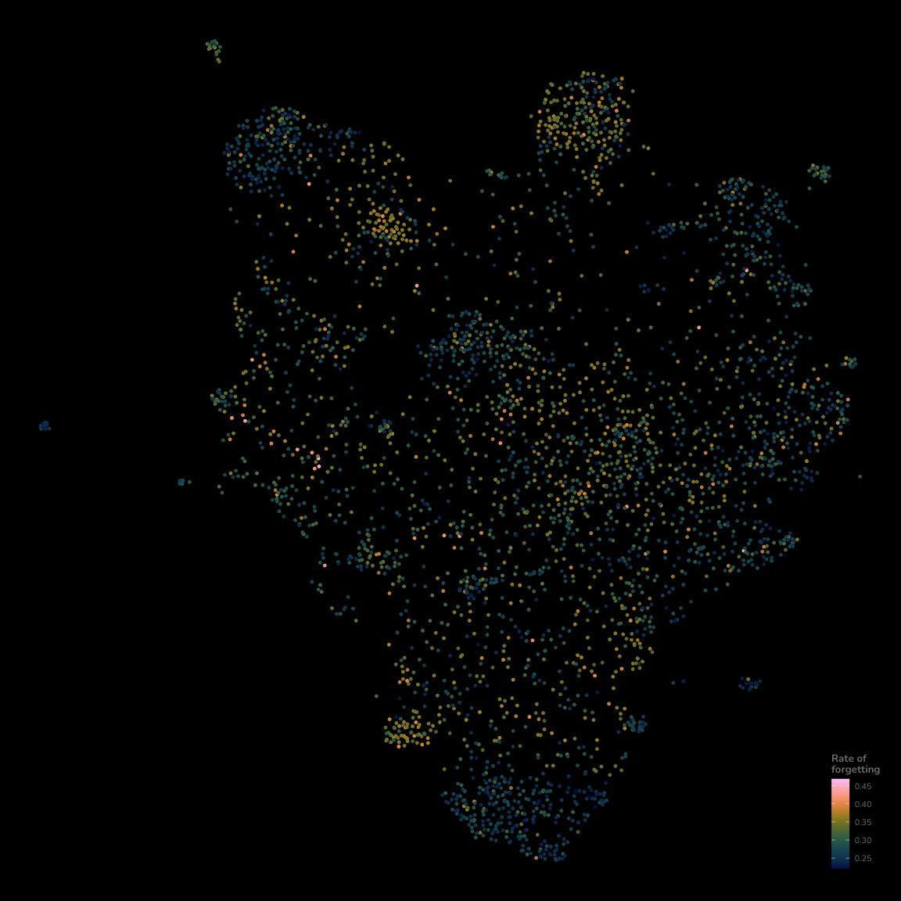

Visualising the memorability of second-language vocabulary items
================
Maarten van der Velde
Last updated: 2023-07-03

- [Setup](#setup)
- [Data](#data)
- [Embeddings](#embeddings)
- [Dimensionality reduction with
  UMAP](#dimensionality-reduction-with-umap)
- [Visualisation](#visualisation)

# Setup

``` r
library(here)
```

    ## here() starts at /Users/maarten/Documents/projects/rof-embeddings

``` r
library(data.table)
library(fst)
library(text)
```

    ## This is text (version 0.9.99.2).
    ## Text is new and still rapidly improving.
    ##                
    ## Newer versions may have improved functions and updated defaults to reflect current understandings of the state-of-the-art.
    ##                Please send us feedback based on your experience.
    ## 
    ## Please note that defaults has changed in the textEmbed-functions since last version; see help(textEmbed) or www.r-text.org for more details.

``` r
library(stringr)
library(ggplot2)
library(scico)
library(plotly)
```

    ## 
    ## Attaching package: 'plotly'

    ## The following object is masked from 'package:ggplot2':
    ## 
    ##     last_plot

    ## The following object is masked from 'package:stats':
    ## 
    ##     filter

    ## The following object is masked from 'package:graphics':
    ## 
    ##     layout

``` r
library(uwot)
```

    ## Loading required package: Matrix

``` r
library(extrafont)
```

    ## Registering fonts with R

``` r
set.seed(42)

theme_set(theme_bw(base_size = 16, base_family = "sans"))

# Run once to import the Nunito font
# font_import(pattern = "Nunito")
# loadfonts()
```

# Data

Load rate of forgetting predictions per fact (from the *Fact* prediction
method in
[https://doi.org/10.31234/osf.io/z3vtn](van%20der%20Velde%20et%20al.,%202023)),
as well as the word or phrase associated with each fact:

``` r
# English
rof_pred_en <- read_fst(here("data", "pred_fact_Stepping_Stones.fst"), as.data.table = TRUE)
facts_en <- read_fst(here("data", "answers_Stepping_Stones2.fst"), as.data.table = TRUE)
setnames(facts_en, "fact_id_uniq_merged", "fact_id")

fact_rof_en <- rof_pred_en[facts_en, on = "fact_id"]
fact_rof_en <- fact_rof_en[!is.na(mu)]
fact_rof_en <- fact_rof_en[, .(fact_id,
                         n_obs = kappa - 1,
                         rof = mu,
                         answer = answer)]

fact_rof_en[, answer_language := ifelse(tstrsplit(fact_id, "_", fixed = TRUE, keep = 3L)[[1]] == "1", "NL", "EN")]
fact_rof_en[, course := "English"]

# French
rof_pred_fr <- read_fst(file.path("data", "pred_fact_Grandes_Lignes.fst"), as.data.table = TRUE)
facts_fr <- read_fst(file.path("data", "answers_Grandes_Lignes2.fst"), as.data.table = TRUE)
setnames(facts_fr, "fact_id_uniq_merged", "fact_id")

fact_rof_fr <- rof_pred_fr[facts_fr, on = "fact_id"]
fact_rof_fr <- fact_rof_fr[!is.na(mu)]
fact_rof_fr <- fact_rof_fr[, .(fact_id,
                         n_obs = kappa - 1,
                         rof = mu,
                         answer = answer)]

fact_rof_fr[, answer_language := ifelse(tstrsplit(fact_id, "_", fixed = TRUE, keep = 3L)[[1]] == "1", "NL", "FR")]
fact_rof_fr[, course := "French"]

# Combine into a single data.table
fact_rof <- rbind(fact_rof_en, fact_rof_fr)
```

Some answers occur across multiple facts (e.g., because the same
vocabulary item appears in multiple contexts, and/or because there are
different questions with the same answer). These will end up overlapping
in the same place in the visualisation, so let’s only keep unique
answers, choosing whichever fact has the most observations:

``` r
chars_to_remove <- "[^[:alnum:] ']" # Remove every character that isn't alphanumeric or an apostrophe
fact_rof[, answer_simplified := str_squish(str_replace_all(str_to_lower(answer), chars_to_remove, ""))]
fact_rof_nodup <- fact_rof[, .SD[n_obs == max(n_obs)], by = .(course, answer_simplified, answer_language)]
```

# Embeddings

We’ll use a pretrained model to get embeddings for all the answers in
the set. With the `text` package we can get [fastText
embeddings](https://fasttext.cc/docs/en/crawl-vectors.html) based on
data from Common-Crawl and Wikipedia (see [Grave et al.,
2018](https://doi.org/10.48550/arXiv.1802.06893) for details).

``` r
get_fasttext_embeddings <- function(sentences, model_path) {
  # Save sentences to a temporary text file
  temp_file <- tempfile(fileext = ".txt")
  writeLines(sentences, temp_file)
  
  # Save embeddings to a temporary text file
  output_file <- tempfile()
  
  # Run the fastText command-line interface to obtain embeddings
  command <- paste("cd models && fastText/fasttext print-sentence-vectors", model_path, "<", temp_file, ">", output_file)
  system(command)
  
  # Get embeddings from file
  embeddings <- read.table(output_file)
  
  # Clean up temporary files
  unlink(temp_file)
  unlink(output_file)
  
  return(embeddings)
}
```

``` r
# English
model_path_en <- here("models", "cc.en.300.bin")
embeddings_en <- cbind(fact_rof_nodup[answer_language == "EN"],
                       fact_rof_nodup[answer_language == "EN",
                                      get_fasttext_embeddings(answer, model_path_en)])

# French
model_path_fr <- here("models", "cc.fr.300.bin")
embeddings_fr <- cbind(fact_rof_nodup[answer_language == "FR"],
                       fact_rof_nodup[answer_language == "FR",
                                      get_fasttext_embeddings(answer, model_path_fr)])
```

# Dimensionality reduction with UMAP

We now have 300-dimensional embeddings for each vocabulary item, which
is about 298 too many for a visualisation that we can understand. The
technique of Uniform Manifold Approximation and Projection (UMAP;
[McInnes, Healy, & Melville,
2018](https://doi.org/10.48550/arXiv.1802.03426)) collapses these 300
dimensions down to 2. UMAP attempts to preserve patterns in the
high-dimensional space in its lower-dimensional projection: it tries to
keep items that are neighbours close together, and also to maintain the
global structure. It is important to keep in mind that (distances along)
the axes of the 2D plot are in themselves not interpretable (in contrast
to principle component analysis).

UMAP has several parameters that define how it determines the distance
between items, the number of neighbours it considers around each item,
and the relative scaling of within- and between-cluster space. There are
no “correct” values to use and the best settings depend on the nature of
the data and the desired appearance of the end result (e.g., should
clusters be more or less clumped together). The settings I have used
below appear to be a good compromise that shows some local structure
while also leaving enough room for text labels within dense clusters.

``` r
embeddings_en_umap <- umap(embeddings_en[,6:305],
                           n_components = 2,
                           metric = "cosine",
                           n_neighbors = 50,
                           min_dist = 0.5,
                           spread = 25
                           )


embeddings_en_umap_plot <- cbind(fact_rof_nodup[answer_language == "EN"],
                                 as.data.frame(embeddings_en_umap, stringsAsFactors = FALSE))


embeddings_fr_umap <- umap(embeddings_fr[,6:305],
                           n_components = 2,
                           metric = "cosine",
                           n_neighbors = 50,
                           min_dist = 0.5,
                           spread = 15
                           )


embeddings_fr_umap_plot <- cbind(fact_rof_nodup[answer_language == "FR"],
                                 as.data.frame(embeddings_fr_umap, stringsAsFactors = FALSE))
```

# Visualisation

For the 2D visualisation, we want to prioritise plotting items with high
rate of forgetting. In case of overlapping labels, we’d rather see the
most difficult item.

``` r
setorder(embeddings_en_umap_plot, -rof)
setorder(embeddings_fr_umap_plot, -rof)
```

First, draw a version of the plot with a point for each vocabulary item.
The colour of the point shows the rate of forgetting.

``` r
p_en_umap <- ggplot(embeddings_en_umap_plot,
                    aes(x = V1, y = V2, colour = rof, label = answer)) +
  geom_point(size = 1) +
  scale_colour_scico(palette = "batlow") +
  labs(colour = "Rate of\nforgetting") +
  theme_void(base_size = 10) +
  theme(panel.background = element_rect(fill = "black", colour = "black"),
        legend.position = c(.95, .1),
        legend.title = element_text(colour = "grey50", family = "Nunito", face = "bold"),
        legend.text = element_text(colour = "grey50", family = "Nunito"))

p_en_umap
```

<!-- -->

``` r
ggsave(p_en_umap,
       filename = file.path("output", "embeddings_en_umap_points.png"),
       width = 12,
       height = 12,
       dpi = 300,
       device = png,
       type = "cairo",
       limitsize = FALSE)


p_fr_umap <- ggplot(embeddings_fr_umap_plot,
                    aes(x = -V1, y = V2, colour = rof, label = answer)) +
  geom_point(size = 1) +
  scale_colour_scico(palette = "batlow") +
  labs(colour = "Rate of\nforgetting") +
  theme_void(base_size = 10) +
  theme(panel.background = element_rect(fill = "black", colour = "black"),
        legend.position = c(.95, .1),
        legend.title = element_text(colour = "grey50", family = "Nunito", face = "bold"),
        legend.text = element_text(colour = "grey50", family = "Nunito"))

p_fr_umap
```

<!-- -->

``` r
ggsave(p_fr_umap,
       filename = file.path("output", "embeddings_fr_umap_points.png"),
       width = 12,
       height = 12,
       dpi = 300,
       device = png,
       type = "cairo",
       limitsize = FALSE)
```

We can see some really interesting structure in both languages. For
English, there appears to be a few regions on one side that have many of
the higer-RoF items. We also see some clusters. The French plot shows
stronger clustering, and also seems to show clear differences in average
RoF between different clusters. Interesting!

Now let’s make a bigger version of the plot with text labels on the
individual vocabulary items, so we can see which items they are.

``` r
p_en_umap_text <- ggplot(embeddings_en_umap_plot,
                    aes(x = V1, y = V2, colour = rof, label = answer)) +
  geom_point(size = 3) +
  geom_text(colour = "white", 
            size = ifelse(nchar(embeddings_en_umap_plot$answer) > 25, 1.5, 2),
            nudge_y = .5, family = "Nunito", check_overlap = TRUE) +
  geom_text(aes(colour = rof), 
            alpha = .75, 
            size = ifelse(nchar(embeddings_en_umap_plot$answer) > 25, 1.5, 2),
            nudge_y = .5, family = "Nunito", check_overlap = TRUE) +
  scale_colour_scico(palette = "batlow") +
  labs(colour = "Rate of\nforgetting") +
  theme_void(base_size = 10) +
  theme(panel.background = element_rect(fill = "black", colour = "black"),
        legend.position = c(.9625, .05),
        legend.title = element_text(colour = "grey50", family = "Nunito", face = "bold"),
        legend.text = element_text(colour = "grey50", family = "Nunito"))

ggsave(p_en_umap_text,
       filename = file.path("output", "embeddings_en_umap_text.png"),
       width = 33.1,
       height = 33.1,
       dpi = 300,
       device = png,
       type = "cairo",
       limitsize = FALSE)


p_fr_umap_text <- ggplot(embeddings_fr_umap_plot,
                    aes(x = -V1, y = V2, colour = rof, label = answer)) +
  geom_point(size = 3) +
  geom_text(colour = "white", 
            size = ifelse(nchar(embeddings_fr_umap_plot$answer) > 25, 1.5, 2),
            nudge_y = .45, family = "Nunito", check_overlap = TRUE) +
  geom_text(aes(colour = rof), 
            alpha = .75, 
            size = ifelse(nchar(embeddings_fr_umap_plot$answer) > 25, 1.5, 2),
            nudge_y = .45, family = "Nunito", check_overlap = TRUE) +
  scale_colour_scico(palette = "batlow") +
  labs(colour = "Rate of\nforgetting") +
  theme_void(base_size = 10) +
  theme(panel.background = element_rect(fill = "black", colour = "black"),
        legend.position = c(.9625, .05),
        legend.title = element_text(colour = "grey50", family = "Nunito", face = "bold"),
        legend.text = element_text(colour = "grey50", family = "Nunito"))


ggsave(p_fr_umap_text,
       filename = file.path("output", "embeddings_fr_umap_text.png"),
       width = 33.1,
       height = 33.1,
       dpi = 300,
       device = png,
       type = "cairo",
       limitsize = FALSE)
```
